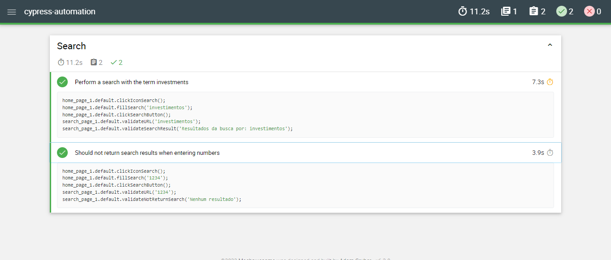

# Cypress Automation

Test automation project responsible for ensuring the flows of the Blog Agi.

## Stack

- [node js](https://nodejs.org/en/)
- [yarn](https://yarnpkg.com/en/docs/install)
- [cypress](https://www.cypress.io/)

## Initial Setup

```shell
git clone https://github.com/raquelvilione/cypress-automation.git
cd cypress-automation
npm install
```

## Execution of Tests
- npm run test:headless or yarn test:headless
- npm run tags:search or yarn tags:search

## Report
- npm run combine-reports or yarn combine-reports
- npm run generate-report or yarn generate-report

